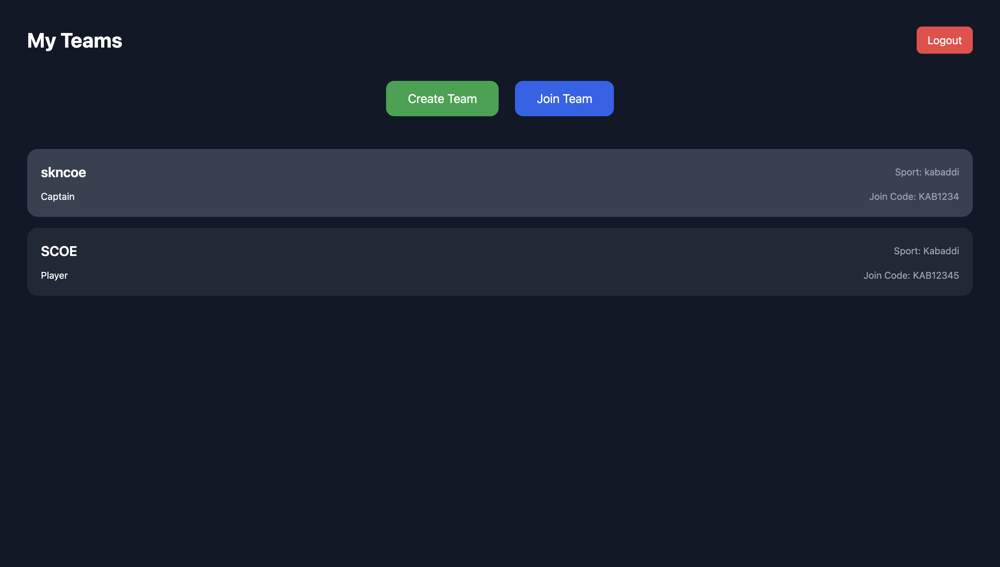
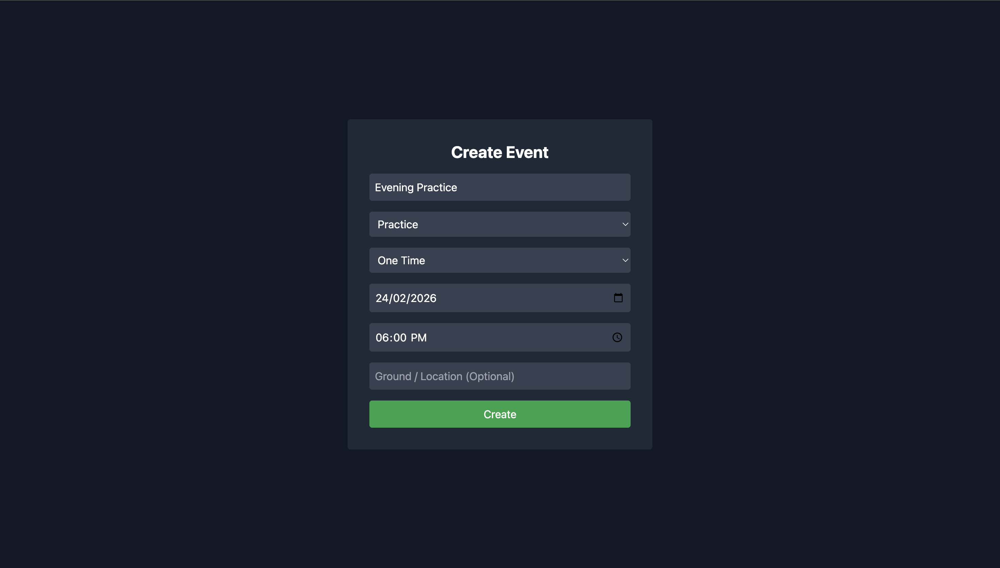
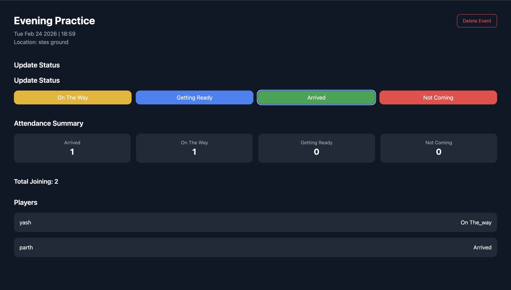

# 🏆 PlayReady – Sports Team Management Platform

PlayReady is a full-stack MERN application designed to streamline sports team coordination by replacing unstructured chat-based scheduling with automated event management and real-time attendance tracking.

---

## 🚀 Live Demo

🔗 Frontend: https://play-ready.vercel.app  
🔗 Backend API: https://playready-backend.onrender.com  

---

## 📌 Problem Statement

Traditional team coordination via chat platforms leads to:

- Unstructured communication
- Manual counting of confirmations
- Repetitive follow-up messaging
- No recurring event automation
- No participation analytics

PlayReady introduces a structured system for managing teams, events, and attendance efficiently.

---

## ✨ Key Features

- 🔐 JWT-based Authentication & Protected Routes
- 👥 Multi-team Management (Captain & Player Roles)
- 📅 Event Scheduling (One-time, Daily & Weekly Recurrence)
- 📊 Real-time Attendance Tracking
- ⚡ Automated Status Aggregation (Arrived / On The Way / Not Coming)
- 📈 Live Participation Summary Dashboard
- ☁️ Cloud Deployment (Vercel + Render + MongoDB Atlas)

---

## 📈 Impact

- Supports 140+ active team members
- Reduced manual coordination effort by ~50–60%
- Eliminated repetitive follow-up messaging during practice scheduling
- Structured event workflow replacing informal chat-based coordination

---

## 🛠 Tech Stack

### Frontend
- React.js
- React Router
- Axios
- Tailwind CSS

### Backend
- Node.js
- Express.js
- MongoDB Atlas
- Mongoose
- JWT Authentication
- CORS Middleware

### Deployment
- Vercel (Frontend)
- Render (Backend)
- MongoDB Atlas (Database)

---

## 🏗 Architecture Overview

- RESTful API design
- JWT-secured authentication middleware
- Role-based team membership model
- Recurring event logic (daily / weekly scheduling)
- Aggregated attendance status tracking
- Cloud-hosted production deployment

---


## 📸 Screenshots

### Dashboard


### Team Dashboard


### Create Event


### Event Detail


## ⚙️ Local Setup Instructions

### 1️⃣ Clone the Repository

```bash
git clone https://github.com/Y-A-S-H-07/PlayReady.git
cd PlayReady
```

---

### 2️⃣ Backend Setup

```bash
cd backend
npm install
npm run dev
```

Create a `.env` file inside the `backend` folder:

```env
MONGO_URI=your_mongodb_connection_string
JWT_SECRET=your_secret_key
```

Backend runs on:  
http://localhost:5001

---

### 3️⃣ Frontend Setup

```bash
cd frontend
npm install
npm run dev
```

Frontend runs on:  
http://localhost:5173

## 🔒 Security Considerations

- JWT-based authentication
- Protected API routes
- Environment variables for sensitive configuration
- CORS configuration for production

---

## 🧠 Future Improvements

- Attendance analytics dashboard
- Captain-only admin controls
- Notification system
- Mobile-responsive optimization
- Performance monitoring
- Enhanced role-based access control

---

## 👤 Author

**Yash Dabhekar**  
Full Stack Developer
